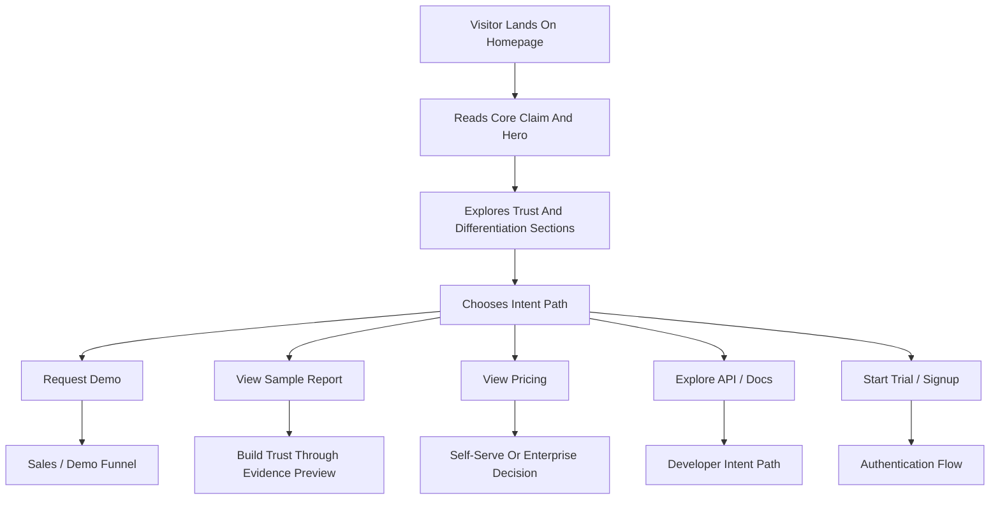

## 1. Product Overview
Provance needs a premium landing experience that establishes the company as the fastest trustworthy image and video verification platform with explainable evidence, downloadable forensic reports, and enterprise-ready trust workflows.
- The landing surface must convert visitors into demos, trials, and API-interest leads while building credibility with investors, journalists, investigators, enterprise buyers, and developers.
- The page must feel world-class, operationally serious, and distinct from generic AI detector marketing sites.

## 2. Core Features

### 2.1 User Roles
| Role | Registration Method | Core Permissions |
|------|---------------------|------------------|
| Visitor | None | Browse public pages, view product positioning, request demo, start trial |
| Prospect | Demo form or signup | Submit interest, access next-step conversion flows |
| Developer Prospect | Signup intent or docs CTA | Explore API path and enter auth funnel |

### 2.2 Feature Module
1. **Homepage**: hero section, trust bar, problem framing, how-it-works, standout claims, use cases, report preview, pricing preview, FAQ, final CTA
2. **Product page**: workflow preview, evidence preview, report preview, dashboard preview
3. **Solutions page**: journalism, legal/investigations, enterprise trust/fraud, developers/API
4. **Pricing page**: tier previews, CTA routing for trial vs sales-led paths
5. **Methodology page**: signal categories, explainability, uncertainty handling, limitations
6. **Sample Report page**: report preview, verdict summary, evidence preview, CTA into demo/signup
7. **Docs / API page**: developer teaser, integration overview, API CTA
8. **Security page**: storage handling, privacy posture, audit and retention stance

### 2.3 Page Details
| Page Name | Module Name | Feature description |
|-----------|-------------|---------------------|
| Homepage | Hero | Lead with the exact standout claim and direct users into demo or sample report review |
| Homepage | Trust Bar | Present credibility markers such as explainable evidence, image + video support, forensic reports, enterprise workflows |
| Homepage | Problem Section | Contrast Provance against black-box detectors and low-trust score-only tools |
| Homepage | How It Works | Explain upload, analysis, result, and downloadable report in a simple three-step flow |
| Homepage | Standout Claims | Highlight image + video verification, explainability, downloadable reports, honest uncertainty, enterprise readiness |
| Homepage | Use Cases | Route visitors by ICP: journalists, legal/investigations, enterprise trust/fraud, developers |
| Homepage | Sample Report Preview | Show what a real output looks like and create a trust anchor |
| Homepage | Pricing Preview | Separate self-serve and enterprise intent without overcommitting pricing detail |
| Homepage | FAQ | Resolve trust, speed, accuracy, API, and evidence questions |
| Product Page | Product Narrative | Expand on workflow, dashboard, uploads, results, and reports |
| Solutions Page | Segment Modules | Reframe the product by buyer pain and value |
| Methodology Page | Transparency Module | Explain signal categories, model governance, uncertainty, and limitations |
| Sample Report Page | Report Walkthrough | Preview verdict, evidence sections, audit metadata, and download concept |
| Docs / API Page | Developer Funnel | Introduce integration model and direct prospects to signup or docs |
| Security Page | Trust Assurance | Present file handling, retention, privacy, and enterprise trust posture |

## 3. Core Process
The public-site experience should move a visitor from curiosity to trust to conversion. The homepage establishes authority and differentiation immediately, then routes visitors into the right path based on intent. Professional buyers should be able to inspect the methodology and sample report before requesting a demo. Developers should be able to see the API path quickly. Trial-ready users should be able to move into signup without confusion.

## 4. User Interface Design
### 4.1 Design Style
- Primary and secondary colors: dark operator-console base with restrained graphite, deep charcoal, muted steel, and one sharp signal accent
- Button style: premium rectangular or softly rounded action buttons with crisp borders and strong hover states
- Font and sizes: distinctive editorial display font paired with a highly legible technical sans; large, confident hero typography
- Layout style: desktop-first asymmetric sections with strong rhythm, premium spacing, and dashboard-inspired visual language
- Icon style suggestions: forensic / systems / trust motifs, minimal line icons, evidence-card metaphors, subtle data-grid visuals

### 4.2 Page Design Overview
| Page Name | Module Name | UI Elements |
|-----------|-------------|-------------|
| Homepage | Hero | strong headline, subheadline, two CTAs, atmospheric background, premium motion, product artifact preview |
| Homepage | Trust Bar | badge-style credibility chips, soft dividers, subtle scanline or grid treatment |
| Homepage | Problem Section | editorial blocks, contrast statements, short evidence-focused copy |
| Homepage | How It Works | step cards, directional flow, upload/result/report visual anchors |
| Homepage | Standout Claims | bold modular claim cards, differentiated value framing |
| Homepage | Use Cases | segmented cards with tailored copy and CTA hints |
| Homepage | Sample Report | report mockup panel, verdict callout, metadata strip, download affordance |
| Homepage | Pricing Preview | tier cards with clear CTA hierarchy |
| Product Page | Workflow Preview | dashboard mockups, upload-to-result visuals, report artifact treatment |
| Methodology Page | Trust Sections | clean technical sections, limitations callout, confidence language blocks |

### 4.3 Responsiveness
- Desktop-first design with strong large-screen composition
- Tablet adaptation should preserve hierarchy and premium spacing
- Mobile adaptation should stack sections cleanly while keeping CTAs prominent
- Touch targets must remain comfortable for mobile demo and signup flows
