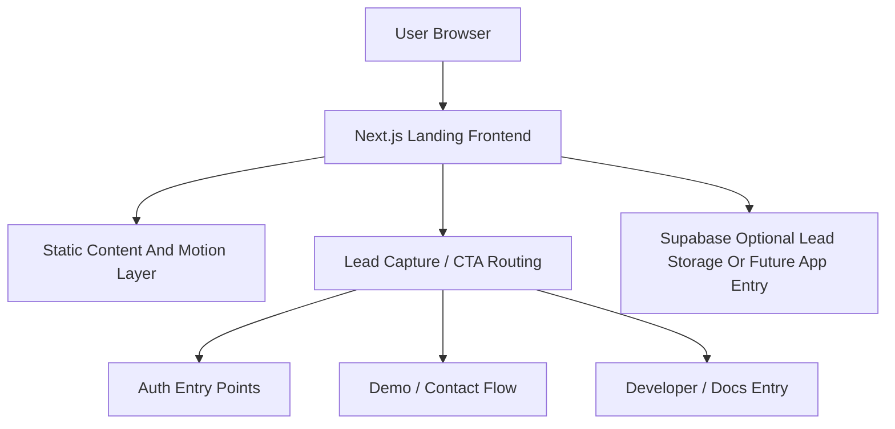
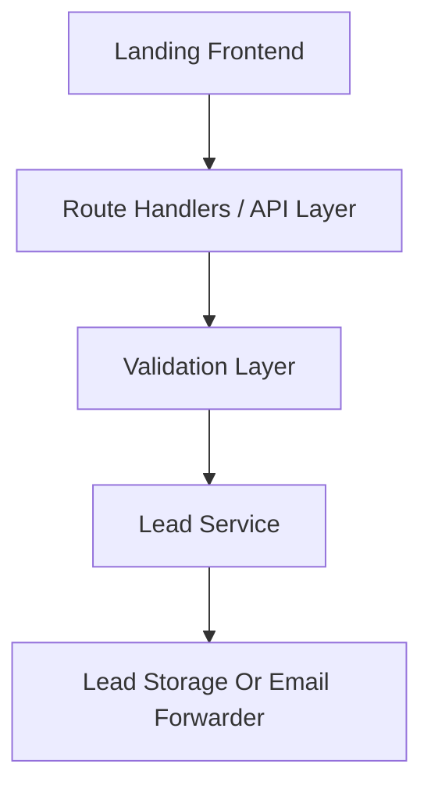
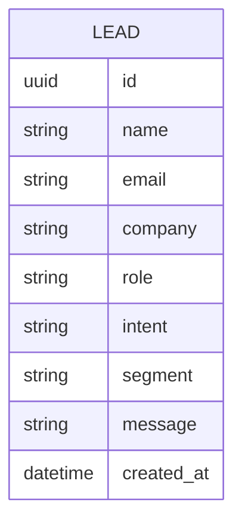

## 1. Architecture Design



## 2. Technology Description
- Frontend: Next.js 15 + React 18 + TypeScript + Tailwind CSS 3
- Styling: Tailwind CSS + CSS variables + component-level motion and texture system
- UI system: shared design tokens and reusable section primitives
- Forms: lightweight schema validation and submission handling
- Media / visuals: optimized static assets and generated product-art placeholders where needed
- Deployment: Vercel or equivalent frontend deployment target

## 3. Route Definitions
| Route | Purpose |
|-------|---------|
| `/` | Main landing page with positioning, trust sections, and conversion CTAs |
| `/product` | Detailed product workflow page |
| `/solutions` | High-level solutions hub or segment overview |
| `/solutions/journalism` | Journalism and fact-checking solution page |
| `/solutions/legal` | Legal and investigations solution page |
| `/solutions/enterprise` | Enterprise trust and fraud solution page |
| `/solutions/developers` | Developer and API solution page |
| `/pricing` | Pricing preview and package routing page |
| `/methodology` | Explainability, signal categories, and limitations page |
| `/sample-report` | Downloadable report preview and proof page |
| `/docs` | Developer teaser / docs landing |
| `/security` | Security and trust posture page |
| `/signin` | Auth entry route placeholder or actual auth page |
| `/signup` | Signup route placeholder or actual auth page |

## 4. API Definitions
### TypeScript Type Definitions
```ts
export type CtaIntent =
  | "request_demo"
  | "start_trial"
  | "view_sample_report"
  | "explore_api"
  | "contact_sales";

export interface LeadCapturePayload {
  name: string;
  email: string;
  company?: string;
  role?: string;
  intent: CtaIntent;
  segment?: "journalism" | "legal" | "enterprise" | "developer" | "other";
  message?: string;
}

export interface LeadCaptureResponse {
  success: boolean;
  message: string;
}
```

### Request / Response Schemas
- `POST /api/lead`
  - Request: `LeadCapturePayload`
  - Response: `LeadCaptureResponse`
- `GET /api/health`
  - Request: none
  - Response: `{ "status": "ok" }`

## 5. Server Architecture Diagram



## 6. Data Model
### 6.1 Data Model Definition



### 6.2 Data Definition Language
```sql
create table if not exists leads (
  id uuid primary key default gen_random_uuid(),
  name text not null,
  email text not null,
  company text,
  role text,
  intent text not null,
  segment text,
  message text,
  created_at timestamptz not null default now()
);

create index if not exists idx_leads_email on leads (email);
create index if not exists idx_leads_intent on leads (intent);
create index if not exists idx_leads_created_at on leads (created_at desc);
```

## 7. Implementation Notes
- The landing page should be built as a premium static-first frontend with selective dynamic behavior for forms and CTA handling.
- The standout claim must appear in the hero and be reinforced by supporting sections rather than repeated mechanically.
- Public pages should be fast, SEO-friendly, and visually differentiated from generic AI marketing sites.
- Early lead capture can post to a simple route handler and later connect to Supabase or CRM without redesigning the frontend.
